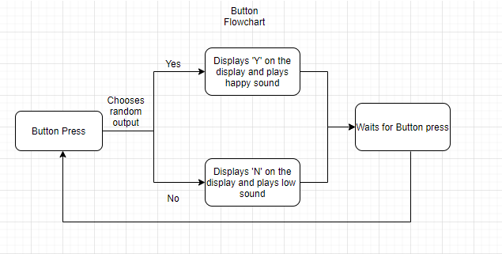
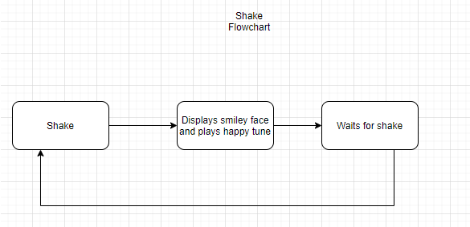
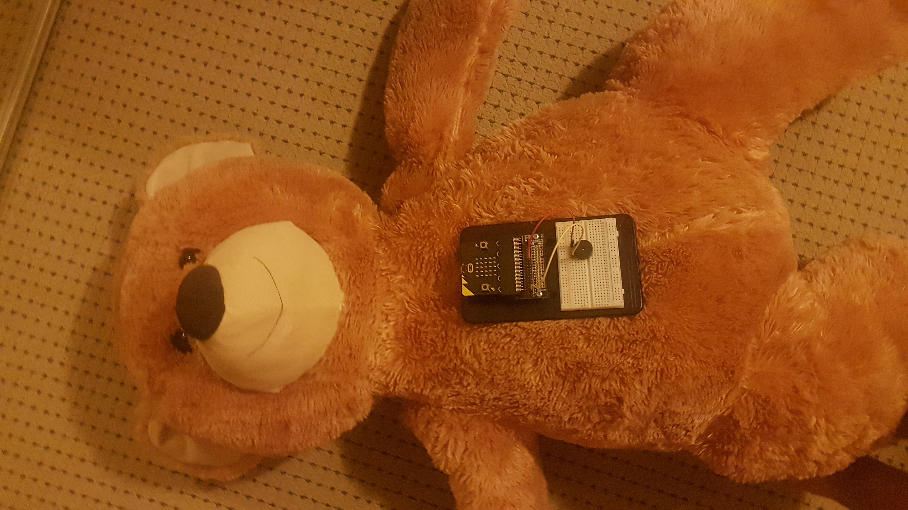

# 1701QCA Final project journal: Teddy Bear

<!--- As for other assessments, fill out the following journal sections with information relevant to your project. --->

<!--- Markdown reference: https://guides.github.com/features/mastering-markdown/ --->

## Related projects ##
<!--- Find about 6 related projects to the project you choose. A project might be related through  function, technology, materials, fabrication, concept, or code. Don't forget to place an image of the related project in the appropriate folder and insert the filename in the appropriate places below. Copy the markdown block of code below for each project you are showing. --->

### Related project 1 ###
Buzz Wire with score counter

https://www.hackster.io/behrooz66/buzz-wire-with-score-counter-e308ef

This project is related to mine because it is interactive and can be used as a toy. The project displays a wire which the user will go around.cThe user has a seperate wire and if the two connect, a loud sound is projected from the speaker in the form of a buzz. Meaning that they lost. 

### Related project 2 ###
Plush Toy Translator

https://www.hackster.io/PaulTR/translation-toy-013bfc

This project is relate to mine because it has very similar aspects being a plush toy and being able to interact with it. In this case the user is able to speak to it and it translates the voice although the project is a little more advanced it has a similar outcome where the user is able to play with the toy and learn something new. 

### Related project 3 ###
Portal 2 talking Turret

https://www.hackster.io/Novachris/talking-portal-2-turret-gun-637bf3

This project is related to mine because it has the speaker aspect to the toy. It isn't that interactive with playing and shaking though it just talks like a robot from the video game portal. 

### Related project 4 ###
Buddy the 3D-Printed Arduino Social Robot

https://create.arduino.cc/projecthub/slantconcepts/buddy-the-3d-printed-arduino-social-robot-ec3dca?ref=tag&ref_id=toys&offset=23

This project is related to mine because it is a toy that has a social aspect to it. My project also has a social aspect to it as it answers questions you can ask it and will give a answer. The buddy social robot is considered to be 'alive' in a way as it moves and looks around the room. My bear will also be considered 'alive' as it creates sounds when shaked and also answers questions. 

### Related project 5 ###
Magic 8 Ball

https://www.instructables.com/id/Digital-Magic-8-Ball/

This project is related to mine because it is similar in interaction and it answers questions people ask. The difference is mine is in the form or a teddy bear and the user's answers are yes or no, not with a few words. 

### Related project 6 ###
Microbit Unicorn

https://makecode.microbit.org/projects/robot-unicorn

This project is related to mine because it uses a microbit to control actions of the interactive toy. Which is similar as i am using a microbit to code and program a teddy bear to be interactive with and can answer user's questions with 'yes or no'.

## Other research ##
<!--- Include here any other relevant research you have done. This might include identifying readings, tutorials, videos, technical documents, or other resources that have been helpful. For each particular source, add a comment or two about why it is relevant or what you have taken from it. You should include a reference or link to each of these resources. --->

## Conceptual development ##

### Design intent ###
<!--- Include your design intent here. It should be about a 10 word phrase/sentence. --->The main intent is to create a toy that can be enjoyed by all ages and is fun to interact with.I want to use a teddy bear where it can be interacted with and can answer questions you ask it like a magic 8 ball mixed with a plush toy.

### Design ideation ###
<!--- Document your ideation process. This will include the design concepts presented for assessment 2. You can copy and paste that information here. --->

### Final design concept ###
<!--- This should be a description of your concept including its context, motivation, or other relevant information you used to decide on this concept. ---> The final concept would be a teddy bear that will be able to be interacted with and is able to answer Yes or No questions.

What problem do you want to solve?
I want to solve the problem that people are getting all these new toys but some want a classic toy but doesn't like how it is not that interactive. For example a Teddy bear is and always have been a fun toy but eventually children just set it aside on their drawers or it ends up under the bed. Therefore I want to create a bear that won't end up under the bed and will always be fun.

What relation do you want to form or change? What experience do you want to create?
The experience I want to create is a feeling of your toy being alive which creates happiness. I want the users to always have fun when playying with the bear so not only does it feel like a normal bear that is there for your comfort but the user can interact with it in other different ways. 

What kinds of people will be involved in this scenario? What non-human actors/participants? What is the future scenario you imagine?
The people that is the main target would be most likely children however I imagine a future where all ages can enjoy the interactive bear.

What are the start and endpoints of your path?
The start would be brainstorming different ways of adding the intended ideas and ending with a final product that can be interacted and played with. However i think that someone can always improve on your projects so it could be neverending but as far for now the endpoint would be the final product ready to use. 

### Interaction flowchart ###
<!--- Include an interaction flowchart of the interaction process in your project. Make sure you think about all the stages of interaction step-by-step. Also make sure that you consider actions a user might take that aren't what you intend in an ideal use case. Insert an image of it below. It might just be a photo of a hand-drawn sketch, not a carefully drawn digital diagram. It just needs to be legible. --->

In this flowchart it shows the interactions for the shake and button presses. A battery will be connected to the microbit which will be connected to a speaker, so when these actions take place the microbit would get information from the inputs and then give outputs. 

## Process documentation ##
<!--- In this section, include text and images (and potentially links to video) that represent the development of your project including sources you've found (URLs and written references), choices you've made, sketches you've done, iterations completed, materials you've investigated, and code samples. Use the markdown reference for help in formatting the material.

This should have quite a lot of information! It will likely include most of the process documentation from assessment 2 which can be copied and pasted here.

Use subheadings to structure this information. See https://guides.github.com/features/mastering-markdown/ for details of how to insert subheadings.

There will likely by a dozen or so images of the project under construction. The images should help explain why you've made the choices you've made as well as what you have done. --->

In this image it shows the bear i wil be using and the microbit with speaker. 

In this image it shows where I was planning on putting the microbit on the teddy bear and how it would be able to be accessed and interacted with easier 

In this image it shows the code that i start off with. which is trying to create a smiley face when the button is pressed and a tone or music would play. This was because my original idea was that the user can press either A or B and it will interact with the teddy bear and it would then make sounds and display different faces. Eventually I came across one of the researched project and a 8 ball came up and I thought of creating a yes or no response that the bear would make. 

This Screenshot was taken shortly after I decided to change the option that the bear would make faces. I switched it so the bear would display Yes or No on the microbit. I thought it would be quite annoying and or glitch the microbit if i had it spell Yes and No letter by letter. So to save the microbit from malfunctioning from a kid spamming the button i decided to just make the microbit display the letter Y and N for the answers. 

In this image I decided that I wouldn't need a second (B) button and decided to implement a shake option which will create a noise and display a smiley face. 

I realised my shaking wasn't working, i tried multiple tests using this code and adjusting it a little to play sound but my microbit wasnt picking up the shaking option, therefore my final project will not be using shaking. So i decided to add lights being red, yellow and green. 

I was thinking of adding a hunt to the project where the users will be taken around the house to find different items or treasures that will lead them to success. I started coding it by the user pressing the B button, but after the tests the hunt would'nt work. I decided to scrap the idea as the code was a little confusing. So i decided to use the Red, Green and Blue leds to light up when the bear responds to questions. 

I added pins to the Y and N so that lights will display when the button is clicked. 

I started setting up the breadboard with the other lights as seen above 

I tested the breadboard leds and it worked after a few tests, I had to switch around the actual leds that are in the breadboard cause they were backwards. 

I added the last light to the top as i wanted it to flash when pressed but instead it consistantly stayed on so i decided to leave it as i was running out o time. 

## Final code ##

<!--- Include here screenshots of the final code you used in the project if it is done with block coding. If you have used javascript, micropython, C, or other code, include it as text formatted as code using a series of three backticks ` before and after the code block. See https://guides.github.com/features/mastering-markdown/ for more information about that formatting. ---> 

## Design process discussion ##
<!--- Discuss your process used in this project, particularly with reference to aspects of the Double Diamond design methodology or other relevant design process. --->

## Reflection ##

<!--- Describe the parts of your project you felt were most successful and the parts that could have done with improvement, whether in terms of outcome, process, or understanding.---!>

Well i found that the most successful was the intended outcome being that the user will be able to interact with the bear by playing with it and able to ask it questions. I liked how the code for the Y and N came out pretty well with no issues and i feel like it can always be improved on. 

### What techniques, approaches, skills, or information did you find useful from other sources (such as the related projects you identified earlier)? ###

I found that alot of the related projects inspired me to create different things such as displaying answers on the screen, answering questions and being an interactive toy. Some examples of this was in Toy Translator, Magic 8 ball and the Portal 2 talking turret. These inspird me as they all represent interactive projects but they are seperate so i wanted to join them together in a way. 

### What parts of your project do you feel are novel. This is IMPORTANT to help justify a key component of the assessment rubric. ###

I believe my toy is novel as it is unusal then normal teddy bears as it has features such as the saying Y or N outputs to the user which aren't usually found, it also has leds to brighten things up and can be more interactive. It has alot of aspects in one which will make much more different and fun. 

### What might be an interesting extension of this project? In what other contexts might this project be used? ###

This project can be improved on as alot of other aspects can be added like the treasure hunt or adding movements to the bear so it can respond while making a gestures. 
